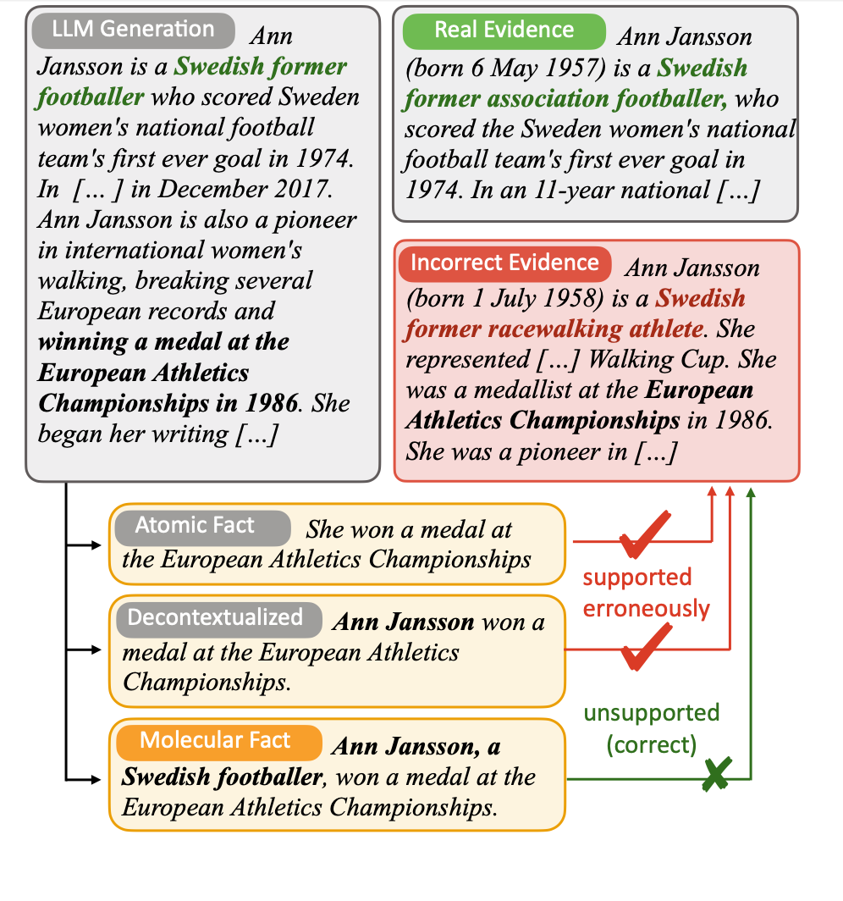

# Molecular Facts: Desiderata for Decontextualization in LLM Fact Verification 

Authors: Anisha Gunjal, Greg Durrett

Please check out our work [here]() 📃

    

### Description

This work evaluates the impact of context and granularity on the factual verification of atomic claims generated by large language models (LLMs). We introduce a framework termed molecular facts, which are optimized for both completeness and brevity. The molecular facts are characterized by two principal attributes:

1. Decontextuality - The ability of claims to be understood independently of additional contextual information.
2. Minimality - The minimum amount of information required to ensure claims are self-sufficient.

We quantify the impact of decontextualization on minimality, then present a baseline methodology for generating molecular facts automatically, aiming to add the right amount of information.

